# PayrollPro — Architecture Documentation

> **Version:** 1.0.0  
> **Last Updated:** July 2025  
> **Framework:** Next.js 16.1.1 (App Router) + Bun + Prisma 6.11.1 + SQLite  
> **Architecture Pattern:** Monolithic SPA with Server-Side API Routes

---

## Table of Contents

1. [System Architecture Diagram](#1-system-architecture-diagram)
2. [Database ER Diagram](#2-database-er-diagram)
3. [API Flow Diagram](#3-api-flow-diagram)
4. [Authentication Flow](#4-authentication-flow)
5. [Module Dependencies](#5-module-dependencies)
6. [Sequence Diagrams](#6-sequence-diagrams)

---

## 1. System Architecture Diagram

### 1.1 High-Level System Overview

```
┌─────────────────────────────────────────────────────────────────────────────────┐
│                              PAYLOAD DELIVERY LAYER                              │
│                                                                                 │
│  ┌─────────────┐      ┌──────────────────┐      ┌──────────────────────────┐  │
│  │   Caddy      │      │   Next.js 16.1   │      │   Bun Runtime            │  │
│  │  Reverse     │─────▶│   App Router     │─────▶│   (Node.js compatible)   │  │
│  │  Proxy :81   │      │   Standalone     │      │                          │  │
│  └─────────────┘      └──────────────────┘      └──────────────────────────┘  │
└─────────────────────────────────────────────────────────────────────────────────┘
                                      │
                                      ▼
┌─────────────────────────────────────────────────────────────────────────────────┐
│                              APPLICATION LAYER                                   │
│                                                                                 │
│  ┌──────────────────────────────────────────────────────────────────────────┐  │
│  │                        CLIENT-SIDE (Browser)                              │  │
│  │                                                                          │  │
│  │  ┌──────────┐  ┌──────────┐  ┌──────────┐  ┌────────────────────────┐  │  │
│  │  │  React   │  │ Zustand  │  │ Recharts  │  │ shadcn/ui (47 comps)  │  │  │
│  │  │  19.0    │  │  5.0.6   │  │  2.15.4   │  │ Radix UI primitives   │  │  │
│  │  └──────────┘  └──────────┘  └──────────┘  └────────────────────────┘  │  │
│  │                                                                          │  │
│  │  ┌──────────────┐  ┌──────────────┐  ┌────────────────────────────┐    │  │
│  │  │ Framer Motion │  │  Tailwind 4  │  │ React Hook Form + Zod 4   │    │  │
│  │  │  12.23.2      │  │  CSS (v4)   │  │ Form validation            │    │  │
│  │  └──────────────┘  └──────────────┘  └────────────────────────────┘    │  │
│  └──────────────────────────────────────────────────────────────────────────┘  │
│                                      │ fetch()                                 │
│                                      ▼                                         │
│  ┌──────────────────────────────────────────────────────────────────────────┐  │
│  │                        SERVER-SIDE (Next.js)                              │  │
│  │                                                                          │  │
│  │  ┌─────────────────────────────────────────────────────────────────┐    │  │
│  │  │                    14 API Route Handlers                         │    │  │
│  │  │  /api/dashboard  /api/employees  /api/attendance  /api/leaves   │    │  │
│  │  │  /api/payroll    /api/reports    /api/settings   /api/salary-slip│    │  │
│  │  │  /api/seed       /api (health)                                 │    │  │
│  │  └─────────────────────────────────────────────────────────────────┘    │  │
│  │                                      │                                   │  │
│  │                                      ▼                                   │  │
│  │  ┌──────────────────────┐  ┌────────────────────────────────────────┐  │  │
│  │  │  Payroll Engine       │  │  Prisma ORM 6.11.1                    │  │  │
│  │  │  (Pure TypeScript)    │  │  SQLite Client                         │  │  │
│  │  │  - PF/ESI/TDS calc    │  │  - Type-safe queries                   │  │  │
│  │  │  - PT/LWF state-wise  │  │  - Single global instance             │  │  │
│  │  │  - New/Old Tax Regime │  │  - Query logging                       │  │  │
│  │  │  - FY 2025-26         │  │                                        │  │  │
│  │  └──────────────────────┘  └────────────────────────────────────────┘  │  │
│  └──────────────────────────────────────────────────────────────────────────┘  │
└─────────────────────────────────────────────────────────────────────────────────┘
                                      │
                                      ▼
┌─────────────────────────────────────────────────────────────────────────────────┐
│                              DATA LAYER                                         │
│                                                                                 │
│  ┌──────────────────────────────────────────────────────────────────────────┐  │
│  │                    SQLite Database (db/custom.db)                         │  │
│  │                    8 Models · 9 Tables · File-based Storage               │  │
│  └──────────────────────────────────────────────────────────────────────────┘  │
└─────────────────────────────────────────────────────────────────────────────────┘
```

### 1.2 Mermaid System Architecture

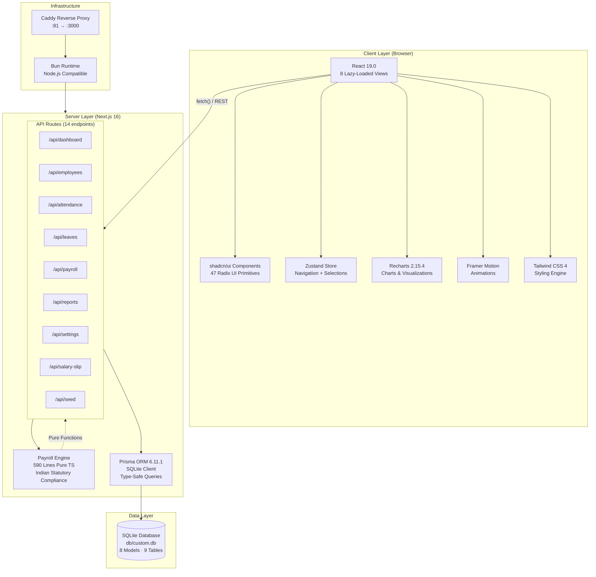

### 1.3 Single-Page Application Architecture

```
┌────────────────────────────────────────────────────────────────┐
│                     Next.js App Router                         │
│                                                                │
│   / (only route)                                               │
│   ├── layout.tsx          → Root Layout (Server Component)     │
│   │   ├── Geist Fonts     → Google Fonts via next/font        │
│   │   ├── Sonner Toaster  → Toast notification container       │
│   │   └── page.tsx        → Client Component (SPA Shell)       │
│   │       ├── PayrollLayout                                   │
│   │       │   ├── Sidebar (animated, collapsible)             │
│   │       │   ├── TopBar (seed button, admin badge)           │
│   │       │   └── ViewRenderer                                │
│   │       │       └── Suspense fallback                       │
│   │       │           └── Active View (lazy-loaded)           │
│   │       └── Fallback: Loading spinner                       │
│   │                                                           │
│   └── api/               → 14 Server-Side Route Handlers      │
│       ├── route.ts       → Health check                       │
│       ├── dashboard/     → KPI aggregation                    │
│       ├── employees/     → CRUD operations                    │
│       ├── attendance/    → Punch & log                        │
│       ├── leaves/        → Applications & balance             │
│       ├── payroll/       → Processing & status                │
│       ├── reports/       → Compliance reports                 │
│       ├── settings/      → Company configuration              │
│       ├── salary-slip/   → Slip generation                    │
│       └── seed/          → Database seeder                    │
└────────────────────────────────────────────────────────────────┘
```

---

## 2. Database ER Diagram

### 2.1 Entity Relationship Diagram

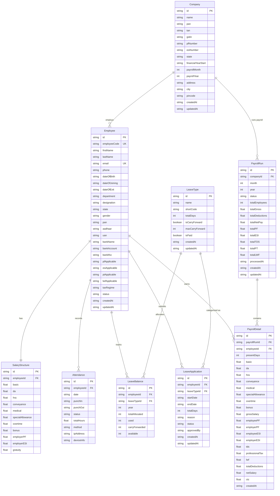

### 2.2 Unique Constraints & Indexes

```
┌─────────────────────────────────────────────────────────────────────────────┐
│                         DATABASE CONSTRAINTS                                 │
├──────────────────────────────┬──────────────────────────────────────────────┤
│ Table                        │ Constraint                                    │
├──────────────────────────────┼──────────────────────────────────────────────┤
│ Employee                     │ employeeCode UNIQUE                           │
│                              │ email UNIQUE                                  │
├──────────────────────────────┼──────────────────────────────────────────────┤
│ Attendance                   │ @@unique([employeeId, date])                  │
├──────────────────────────────┼──────────────────────────────────────────────┤
│ LeaveBalance                 │ @@unique([employeeId, leaveTypeId, year])     │
├──────────────────────────────┼──────────────────────────────────────────────┤
│ PayrollRun                   │ @@unique([companyId, month, year])            │
├──────────────────────────────┼──────────────────────────────────────────────┤
│ SalaryStructure              │ employeeId UNIQUE (1:1 with Employee)         │
└──────────────────────────────┴──────────────────────────────────────────────┘
```

### 2.3 Relationship Cardinality Summary

```
Company      1 ──── ∞  Employee          (One company, many employees)
Company      1 ──── ∞  PayrollRun        (One company, many payroll runs)
Employee     1 ──── 1   SalaryStructure   (One employee, one salary structure)
Employee     1 ──── ∞  Attendance         (One employee, many attendance records)
Employee     1 ──── ∞  LeaveBalance       (One employee, balances per type/year)
Employee     1 ──── ∞  LeaveApplication   (One employee, many leave requests)
Employee     1 ──── ∞  PayrollDetail      (One employee, many payroll records)
LeaveType    1 ──── ∞  LeaveBalance       (One type, many employee balances)
LeaveType    1 ──── ∞  LeaveApplication   (One type, many applications)
PayrollRun   1 ──── ∞  PayrollDetail      (One run, many employee details)
```

---

## 3. API Flow Diagram

### 3.1 Complete API Routing Map

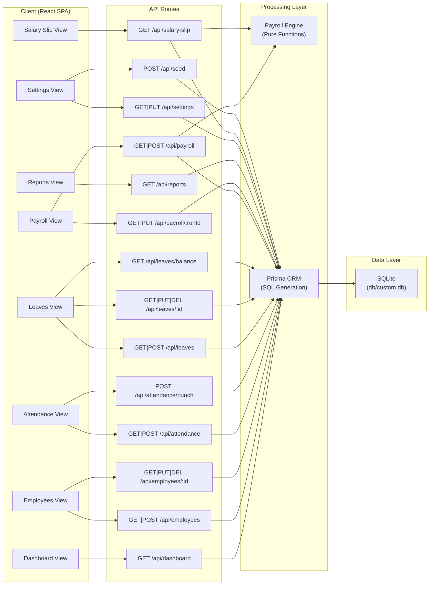

### 3.2 API Endpoint Reference Table

| Endpoint | Method | Input | Output | Processing |
|----------|--------|-------|--------|------------|
| `/api` | GET | — | `{ message }` | None (health check) |
| `/api/dashboard` | GET | — | KPIs, charts, recent runs | 5 parallel Prisma queries |
| `/api/employees` | GET | `?search, ?department, ?state` | Employee[] | Prisma `findMany` with filters |
| `/api/employees` | POST | Employee + SalaryStructure body | Created Employee | Prisma `create` (nested) |
| `/api/employees/[id]` | GET | URL param `id` | Employee + Salary | Prisma `findUnique` with include |
| `/api/employees/[id]` | PUT | Employee + Salary body | Updated Employee | Prisma `update` (nested) |
| `/api/employees/[id]` | DELETE | URL param `id` | Deleted Employee | Prisma `update` (soft: set `dateOfExit`) |
| `/api/attendance` | GET | `?employeeId, ?month, ?year, ?date` | Attendance[] | Prisma `findMany` with filters |
| `/api/attendance` | POST | Attendance body | Created/Updated record | Prisma `upsert` (by employeeId+date) |
| `/api/attendance/punch` | POST | `{ employeeId, method, ... }` | Attendance record | Upsert + auto totalHours calc |
| `/api/leaves` | GET | `?types` flag | LeaveApplication[] or LeaveType[] | Conditional query |
| `/api/leaves` | POST | LeaveApplication body | Created application | Prisma `create` + totalDays calc |
| `/api/leaves/[id]` | GET | URL param `id` | LeaveApplication | Prisma `findUnique` |
| `/api/leaves/[id]` | PUT | `{ status, approvedBy }` | Updated application | Transactional: update status + LeaveBalance |
| `/api/leaves/[id]` | DELETE | URL param `id` | Deleted application | Prisma `delete` |
| `/api/leaves/balance` | GET | `?employeeId, ?year` | LeaveBalance[] | Prisma `findMany` with include |
| `/api/payroll` | GET | `?month, ?year, ?status` | PayrollRun[] | Prisma `findMany` with filters |
| `/api/payroll` | POST | `{ month, year }` | Created PayrollRun | **Payroll Engine** + bulk Prisma `create` |
| `/api/payroll/[runId]` | GET | URL param `runId` | Run + all PayrollDetails | Prisma `findUnique` with include |
| `/api/payroll/[runId]` | PUT | `{ status }` | Updated run | State machine: draft→processed→paid |
| `/api/reports` | GET | `?type (pf\|esi\|tds\|pt\|lwf\|summary)` | Report data | Prisma aggregation queries |
| `/api/settings` | GET | — | Company settings | Prisma `findFirst` or defaults |
| `/api/settings` | PUT | Company body | Updated settings | Prisma `upsert` |
| `/api/salary-slip` | GET | `?employeeId, ?month, ?year` | Salary slip data | Stored detail OR **on-the-fly engine calc** |
| `/api/seed` | POST | — | Seed result | Wipe + create 1 Co, 4 leave types, 6 employees |

### 3.3 Payroll Processing Data Flow

```
┌──────────────┐     POST /api/payroll     ┌────────────────────┐
│  Payroll     │    { month, year }        │  Payroll API       │
│  View        │ ────────────────────────▶ │  Route Handler     │
│  (Client)    │                           └────────┬───────────┘
└──────────────┘                                    │
                                                     ▼
                                          ┌────────────────────┐
                                          │  Fetch All Active  │
                                          │  Employees with    │
                                          │  Salary Structures │
                                          └────────┬───────────┘
                                                   │
                          ┌────────────────────────┼────────────────────────┐
                          ▼                        ▼                        ▼
                   ┌──────────────┐         ┌──────────────┐         ┌──────────────┐
                   │  Employee 1  │         │  Employee 2  │         │  Employee N  │
                   │  + Salary    │         │  + Salary    │         │  + Salary    │
                   └──────┬───────┘         └──────┬───────┘         └──────┬───────┘
                          │                        │                        │
                          ▼                        ▼                        ▼
                   ┌──────────────────────────────────────────────────────────────┐
                   │                   PAYROLL ENGINE                             │
                   │                   (engine.ts)                                │
                   │                                                              │
                   │  1. Prorate earnings by paidDays/daysInMonth                 │
                   │  2. Calculate PF (Basic+DA × 12%, EPS capped ₹15K)          │
                   │  3. Calculate ESI (Gross ≤ ₹21K, 0.75%/3.25%)               │
                   │  4. Calculate PT (State-wise slab lookup)                   │
                   │  5. Calculate LWF (State + frequency-aware)                  │
                   │  6. Calculate TDS (Annualize → Tax Slabs → ÷12)             │
                   │  7. Compute Net = Earnings - All Deductions                 │
                   │  8. Compute CTC = Earnings + Employer Contributions          │
                   └──────────────────────────────────────────────────────────────┘
                          │                        │                        │
                          ▼                        ▼                        ▼
                   ┌──────────────────────────────────────────────────────────────┐
                   │                   Prisma Transaction                         │
                   │                                                              │
                   │  1. Upsert PayrollRun (company+month+year)                   │
                   │  2. Delete existing PayrollDetails for this run              │
                   │  3. Create N PayrollDetail records                           │
                   │  4. Update PayrollRun with aggregate totals                  │
                   └──────────────────────────────────────────────────────────────┘
                                                   │
                                                   ▼
                                          ┌────────────────────┐
                                          │  SQLite Database   │
                                          │  (db/custom.db)    │
                                          └────────────────────┘
```

---

## 4. Authentication Flow

### 4.1 Current State — No Authentication

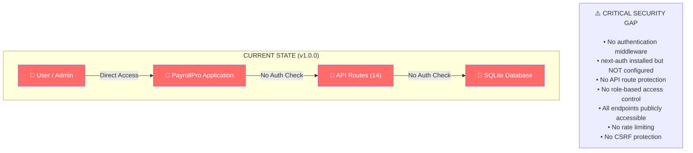

### 4.2 Proposed Authentication Architecture (next-auth v4)

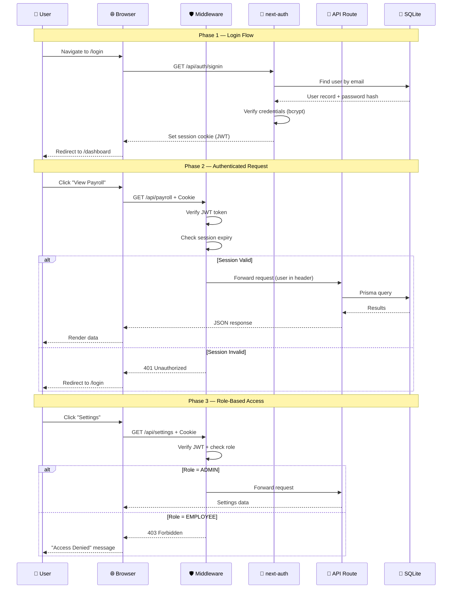

### 4.3 Proposed Middleware Chain

```
┌─────────────────────────────────────────────────────────────────┐
│                    REQUEST LIFECYCLE                             │
│                                                                 │
│  Incoming Request                                               │
│       │                                                         │
│       ▼                                                         │
│  ┌─────────────────┐     ┌──────────────────┐                  │
│  │  Caddy Proxy    │────▶│  Next.js Server   │                  │
│  │  (Port 81→3000) │     │                   │                  │
│  └─────────────────┘     └────────┬──────────┘                  │
│                                   │                              │
│                                   ▼                              │
│  ┌─────────────────────────────────────────────────────────┐   │
│  │           src/middleware.ts (PROPOSED)                    │   │
│  │                                                          │   │
│  │  1. Check if route requires auth (/api/*)                │   │
│  │  2. Extract session token from cookies                   │   │
│  │  3. Verify JWT signature + expiry                        │   │
│  │  4. Extract user roles from token payload                │   │
│  │  5. Match roles against route access matrix              │   │
│  │  6. If valid: attach user to request headers              │   │
│  │  7. If invalid: return 401/403                           │   │
│  └─────────────────────────────────────────────────────────┘   │
│                                   │                              │
│                                   ▼                              │
│  ┌─────────────────────────────────────────────────────────┐   │
│  │              API Route Handler                           │   │
│  │  ┌──────────┐  ┌──────────────┐  ┌───────────────────┐  │   │
│  │  │ Validate  │→│ Business      │→│ Database          │  │   │
│  │  │ Input     │  │ Logic        │  │ Operations        │  │   │
│  │  │ (Zod)     │  │              │  │ (Prisma)          │  │   │
│  │  └──────────┘  └──────────────┘  └───────────────────┘  │   │
│  └─────────────────────────────────────────────────────────┘   │
└─────────────────────────────────────────────────────────────────┘
```

### 4.4 Proposed Role-Based Access Matrix

| Role | Dashboard | Employees | Attendance | Leaves | Payroll | Reports | Settings | Salary Slips |
|------|-----------|-----------|------------|--------|---------|---------|----------|-------------|
| **Admin** | ✅ Full | ✅ CRUD | ✅ All | ✅ Approve | ✅ Process | ✅ All | ✅ CRUD | ✅ All |
| **HR** | ✅ Full | ✅ Read/Create | ✅ All | ✅ Approve | ✅ Process | ✅ Compliance | ❌ | ✅ All |
| **Manager** | ✅ Team | ✅ Team (Read) | ✅ Team | ✅ Team (Read) | ❌ | ✅ Team | ❌ | ✅ Team |
| **Employee** | ✅ Self | ❌ | ✅ Self | ✅ Self | ❌ | ❌ | ❌ | ✅ Self Only |

---

## 5. Module Dependencies

### 5.1 File Dependency Graph

```mermaid
graph TD
    subgraph Entry ["Entry Points"]
        PAGE["page.tsx<br/>(SPA Shell)"]
        LAYOUT["layout.tsx<br/>(Root Layout)"]
    end

    subgraph Components ["View Components (9)"]
        LAY["layout.tsx<br/>Sidebar + Shell"]
        TOP["top-bar.tsx<br/>Header Bar"]
        DASH["dashboard-view.tsx"]
        EMP["employees-view.tsx"]
        ATT["attendance-view.tsx"]
        LEA["leaves-view.tsx"]
        PAY["payroll-view.tsx"]
        SLIP["salary-slip-view.tsx"]
        REP["reports-view.tsx"]
        SET["settings-view.tsx"]
    end

    subgraph State ["State Management"]
        STORE["payroll-store.ts<br/>(Zustand)"]
    end

    subgraph Lib ["Library Layer"]
        DB["db.ts<br/>(Prisma Client)"]
        UTILS["utils.ts<br/>(cn utility)"]
        ENGINE["payroll/engine.ts<br/>(Calculation Engine)"]
        ENGIDX["payroll/index.ts<br/>(Barrel Export)"]
    end

    subgraph Hooks ["Custom Hooks"]
        MOB["use-mobile.ts"]
        TOAST["use-toast.ts"]
    end

    subgraph UI ["UI Primitives (47)"]
        BTN["button.tsx"]
        CARD["card.tsx"]
        DIALOG["dialog.tsx"]
        TABLE["table.tsx"]
        FORM["form.tsx"]
        SELECT["select.tsx"]
        INPUT["input.tsx"]
        TABS["tabs.tsx"]
        BADGE["badge.tsx"]
        AVATAR["avatar.tsx"]
        SKELETON["skeleton.tsx"]
        CHART["chart.tsx"]
        PROGRESS["progress.tsx"]
        OTHER["... +34 more shadcn/ui"]
    end

    subgraph External ["External Dependencies"]
        PRISMA["@prisma/client"]
        ZUSTAND["zustand"]
        RECHARTS["recharts"]
        FRAMER["framer-motion"]
        HOOKFORM["react-hook-form"]
        ZOD["zod"]
        SONNER["sonner"]
        DATEFNS["date-fns"]
        RADIX["@radix-ui/*"]
        LUCIDE["lucide-react"]
    end

    PAGE --> LAY & TOP & STORE
    PAGE --> DASH & EMP & ATT & LEA & PAY & SLIP & REP & SET
    LAYOUT --> PAGE

    LAY --> STORE & BTN & AVATAR & TOOLTIP["tooltip.tsx"]
    TOP --> BTN & SKELETON

    DASH --> CARD & CHART & BADGE & TABLE & PROGRESS
    EMP --> DIALOG & TABLE & FORM & BTN & SELECT & INPUT & TABS
    ATT --> CARD & TABLE & BTN & BADGE & DIALOG
    LEA --> DIALOG & TABLE & FORM & BTN & SELECT & BADGE
    PAY --> CARD & TABLE & DIALOG & BTN & SELECT & BADGE
    SLIP --> CARD & TABLE & BTN & SELECT
    REP --> CARD & TABLE & TABS & BTN & BADGE
    SET --> CARD & FORM & INPUT & SELECT & BTN & ACCORDION["accordion.tsx"]

    STORE --> ZUSTAND
    DASH --> RECHARTS
    LAY --> FRAMER
    EMP --> HOOKFORM & ZOD
    SET --> HOOKFORM & ZOD
    ATT --> DATEFNS

    UI --> RADIX
    UI --> LUCIDE
    OTHER --> RADIX & LUCIDE

    subgraph ServerOnly ["Server-Side Only"]
        API14["14 API Routes"]
        API14 --> DB & ENGINE
        DB --> PRISMA
        ENGINE --> ENGIDX
    end
```

### 5.2 Dependency Categories

```
┌──────────────────────────────────────────────────────────────────────────────┐
│                         DEPENDENCY MATRIX                                     │
├────────────────────┬──────────┬──────────────────────────────────────────────┤
│ Category           │ Count    │ Packages                                     │
├────────────────────┼──────────┼──────────────────────────────────────────────┤
│ Core Framework     │ 3        │ next, react, react-dom                       │
│ Database           │ 2        │ @prisma/client, prisma                       │
│ State Management   │ 1        │ zustand                                      │
│ UI Framework       │ 40+      │ @radix-ui/* (40+ primitives)                 │
│ Styling            │ 5        │ tailwindcss, postcss, clsx, tw-merge, cva   │
│ Forms              │ 3        │ react-hook-form, @hookform/resolvers, zod    │
│ Charts             │ 1        │ recharts                                     │
│ Animation          │ 1        │ framer-motion                                │
│ Date Utilities     │ 1        │ date-fns                                     │
│ Toast              │ 1        │ sonner                                       │
│ Table              │ 1        │ @tanstack/react-table                        │
│ Icons              │ 1        │ lucide-react                                 │
│ Misc               │ 6        │ sharp, next-auth, next-intl, next-themes,    │
│                    │          │ react-markdown, react-syntax-highlighter      │
│ Unused (Installed) │ 14+      │ @dnd-kit/*, @tanstack/react-query, uuid,     │
│                    │          │ next-auth, next-intl, etc.                    │
├────────────────────┼──────────┼──────────────────────────────────────────────┤
│ Dev Dependencies   │ 6        │ typescript, bun-types, eslint,               │
│                    │          │ eslint-config-next, tailwindcss, postcss     │
└────────────────────┴──────────┴──────────────────────────────────────────────┘
```

### 5.3 Import Dependency Heat Map

```
                    ┌─────────────────────────────────────────────────────┐
                    │  Which modules depend on which:                     │
                    ├──────────┬────────┬────────┬────────┬────────┬──────┤
                    │ Store   │ Engine │ db.ts  │ Recharts│ zod    │ hook- │
                    │          │        │        │        │        │ form  │
├───────────────────┼──────────┼────────┼────────┼────────┼────────┼──────┤
│ page.tsx          │ ████    │        │        │        │        │       │
│ layout.tsx        │         │        │        │        │        │       │
│ layout.tsx (comp) │ ████    │        │        │        │        │       │
│ top-bar.tsx       │         │        │        │        │        │       │
│ dashboard-view    │         │        │        │ ████   │        │       │
│ employees-view    │         │        │        │        │ ████   │ ████  │
│ attendance-view   │         │        │        │        │        │       │
│ leaves-view       │         │        │        │        │        │       │
│ payroll-view      │         │        │        │        │        │       │
│ salary-slip-view  │         │        │        │        │        │       │
│ reports-view      │         │        │        │        │        │       │
│ settings-view     │         │        │        │        │ ████   │ ████  │
├───────────────────┼──────────┼────────┼────────┼────────┼────────┼──────┤
│ API: payroll      │         │ ████   │ ████   │        │        │       │
│ API: salary-slip  │         │ ████   │ ████   │        │        │       │
│ API: all others   │         │        │ ████   │        │        │       │
└───────────────────┴──────────┴────────┴────────┴────────┴────────┴──────┘
```

### 5.4 Client vs Server Module Split

```
CLIENT-SIDE ONLY (Browser)                    SERVER-SIDE ONLY (Node.js)
├── src/components/payroll/layout.tsx         ├── src/app/api/** (14 route files)
├── src/components/payroll/top-bar.tsx        ├── src/lib/db.ts (Prisma Client)
├── src/components/payroll/dashboard-view.tsx └── src/lib/payroll/engine.ts
├── src/components/payroll/employees-view.tsx
├── src/components/payroll/attendance-view.tsx
├── src/components/payroll/leaves-view.tsx
├── src/components/payroll/payroll-view.tsx
├── src/components/payroll/salary-slip-view.tsx
├── src/components/payroll/reports-view.tsx
├── src/components/payroll/settings-view.tsx
├── src/store/payroll-store.ts (Zustand)
├── src/hooks/use-mobile.ts
└── src/hooks/use-toast.ts

SHARED (Both)
├── src/lib/utils.ts (cn function)
├── src/components/ui/** (47 shadcn components)
└── src/lib/payroll/index.ts (barrel, but only imported server-side)
```

---

## 6. Sequence Diagrams

### 6.1 Employee Lifecycle

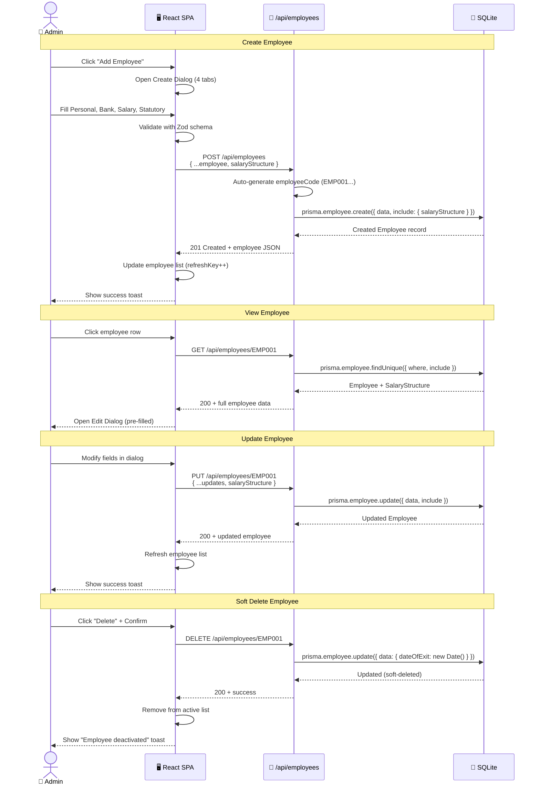

### 6.2 Payroll Processing Flow

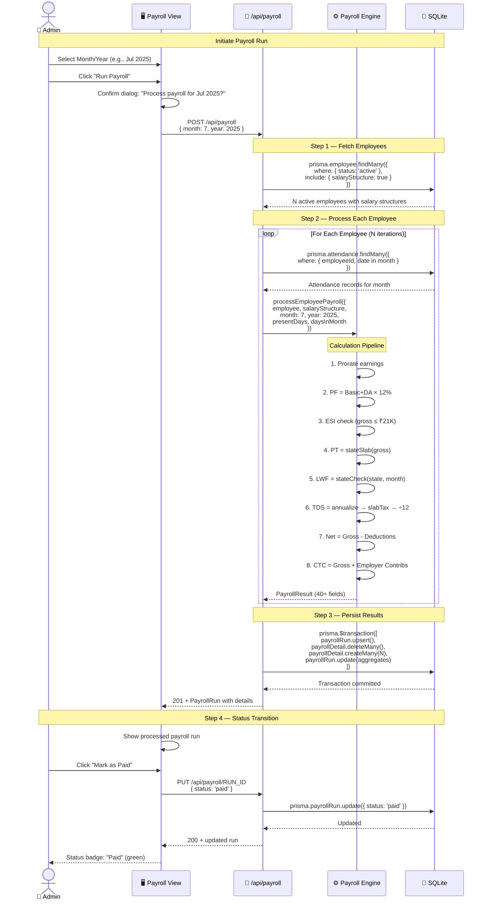

### 6.3 Leave Application & Approval Flow

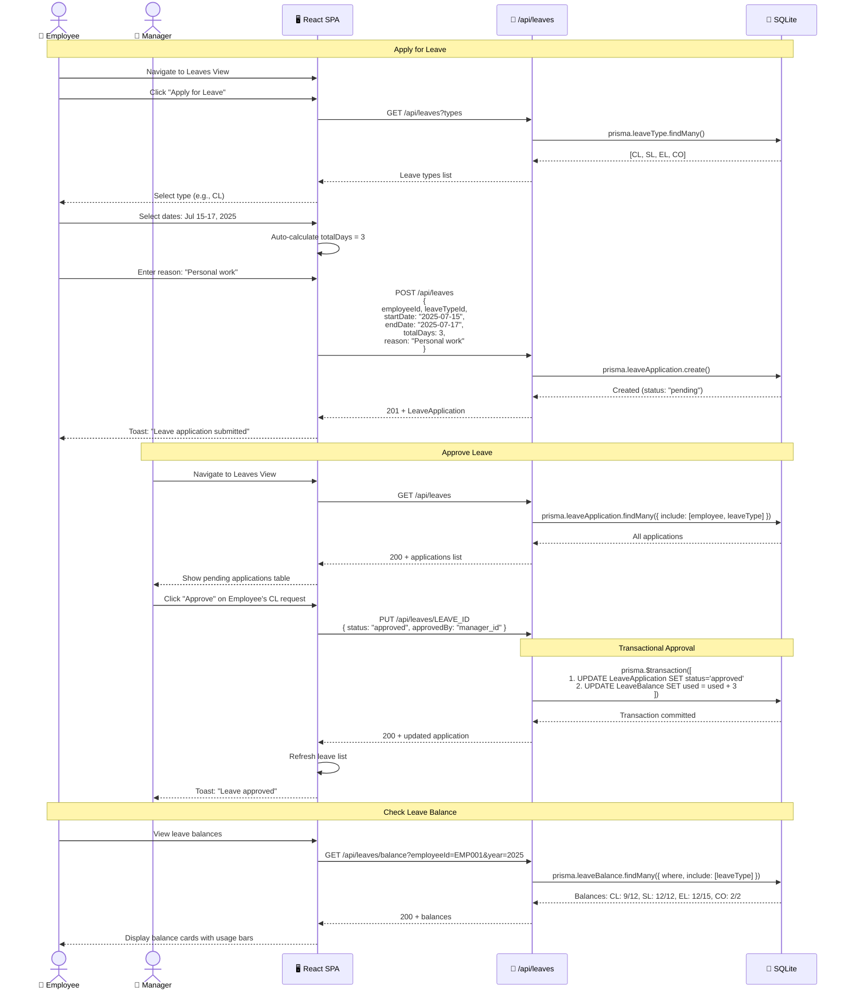

### 6.4 Attendance Punch Flow

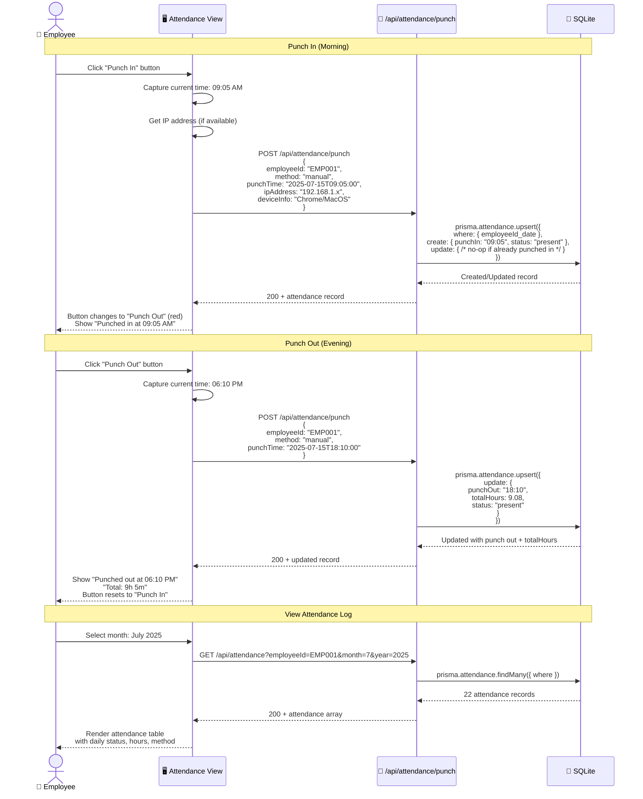

### 6.5 Salary Slip Generation Flow

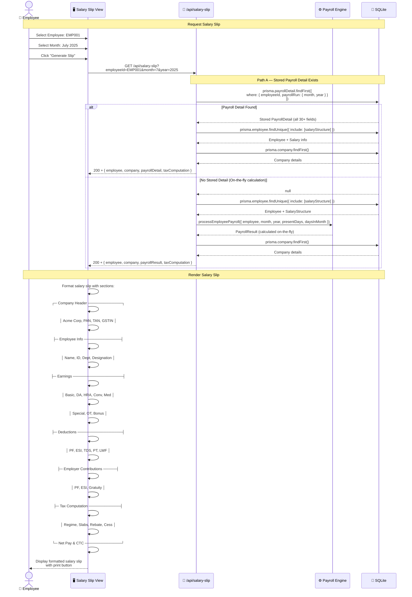

### 6.6 Dashboard Data Aggregation Flow

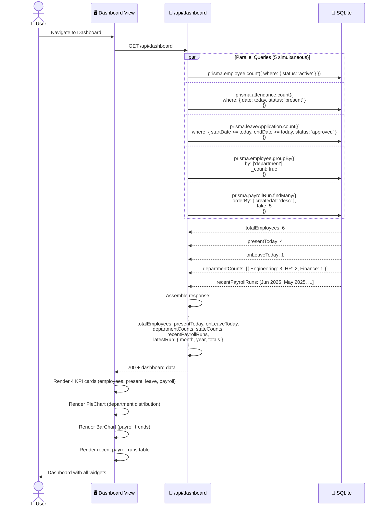

### 6.7 Seed Data Initialization Flow

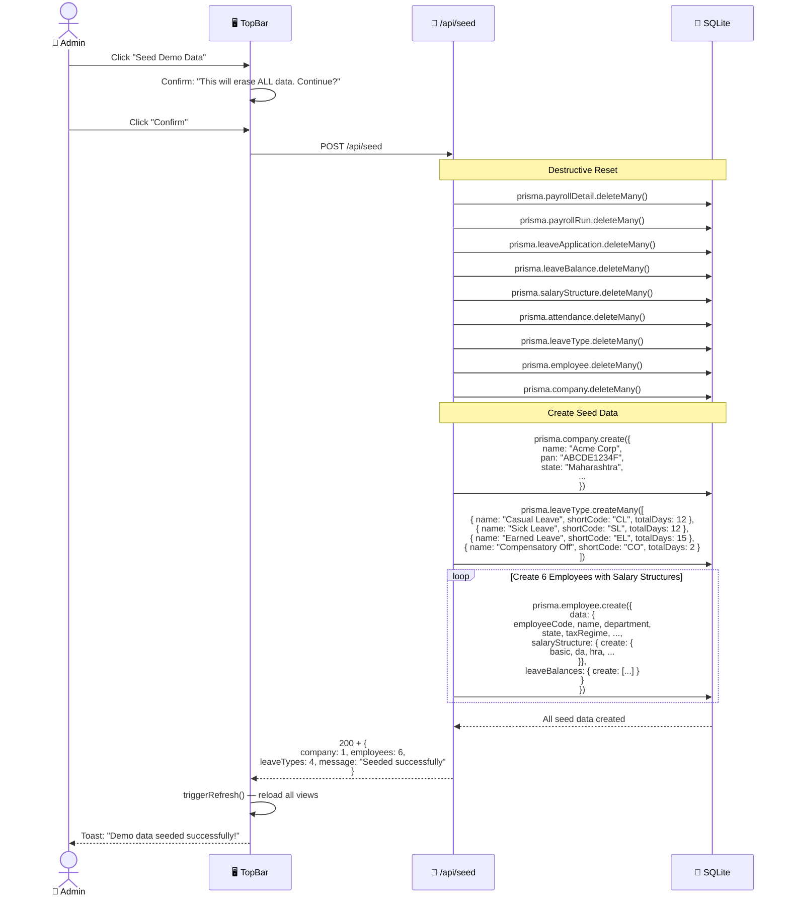

---

## Appendix A: Technology Stack Reference

| Layer | Technology | Version | Purpose |
|-------|-----------|---------|---------|
| Runtime | Bun | Latest | JavaScript runtime (Node.js compatible) |
| Framework | Next.js | 16.1.1 | React framework with App Router |
| Language | TypeScript | 5.x | Type-safe JavaScript |
| UI Library | React | 19.0.0 | Component library |
| UI Components | shadcn/ui (New York) | — | 47 Radix UI primitives |
| Styling | Tailwind CSS | 4.x | Utility-first CSS |
| State | Zustand | 5.0.6 | Client state management |
| Database | SQLite | — | Embedded file-based database |
| ORM | Prisma | 6.11.1 | Type-safe database client |
| Charts | Recharts | 2.15.4 | Data visualization |
| Animation | Framer Motion | 12.23.2 | UI animations |
| Forms | React Hook Form | 7.60.0 | Form state management |
| Validation | Zod | 4.0.2 | Schema validation |
| Icons | Lucide React | — | SVG icon library |
| Toast | Sonner | 2.0.6 | Toast notifications |
| Dates | date-fns | 4.1.0 | Date manipulation |
| Reverse Proxy | Caddy | — | Port 81 → 3000 |

## Appendix B: File Count Summary

| Category | Count | Total Lines (approx) |
|----------|-------|---------------------|
| View Components | 9 | ~7,018 |
| UI Components (shadcn) | 47 | ~5,600 |
| API Route Handlers | 14 | ~2,500 |
| Payroll Engine | 2 | ~600 |
| State Management | 1 | ~30 |
| Hooks | 2 | ~150 |
| Configuration Files | 8 | ~200 |
| Database Schema | 1 | ~120 |
| **Total Source Files** | **~84** | **~16,218** |

---

*Generated for PayrollPro v1.0.0 — Indian Payroll Management System*  
*Architecture documentation covers system design, database schema, API flows, and interaction sequences.*