# PayrollPro Enterprise Expansion — Architecture & API Reference

This document covers the Employee Self-Service (ESS) portal, Onboarding, Exit Management, and
Payroll Engine expansion added in this phase, per the plan at commit time. It's structured to
match the deliverable categories requested for this phase: architecture, database, API, UI,
security, and what's explicitly out of scope.

## 1. Architecture Overview

No new architectural style was introduced — every new surface follows a pattern already
established in the base app:

- **API routes**: Next.js App Router route handlers under `src/app/api/**`, each wrapped in
  `try/catch` → `handleApiError`, auth via `requireAuth`/`requireRole`/`requireOwnEmployeeId`.
- **Self-service isolation**: all employee-facing reads/writes live under `/api/ess/**` and
  derive `employeeId` from the session server-side — never from client input. This is a
  dedicated namespace specifically so self-service logic never has to be retrofitted onto the
  existing admin-facing routes (which assume a trusted admin/hr/manager caller).
- **Documents/letters**: offer, appointment, experience, and relieving letters all reuse the same
  4-piece pattern already used for salary slips and Form 16 — a data-builder function, an HTML
  email-template builder, `sendEmail()` from `mailer.ts` (unchanged), and a copy persisted via
  the new `EmployeeDocument` + local-disk storage subsystem.
- **Notifications**: a new, generic `notify()`/`notifyEmployee()`/`notifyRoles()` helper
  (`src/lib/notifications.ts`) that any route can call fire-and-forget — mirrors the existing
  `logAudit()` helper's "never break the primary request flow" contract.

## 2. Entity-Relationship Diagram

```mermaid
erDiagram
    Company ||--o{ Employee : employs
    Company ||--o{ PayrollRun : runs
    Company ||--o{ Holiday : observes

    Employee ||--o| User : "portal login"
    Employee ||--o| SalaryStructure : has
    Employee ||--o{ Attendance : logs
    Employee ||--o{ LeaveApplication : applies
    Employee ||--o{ LeaveBalance : has
    Employee ||--o{ PayrollDetail : "paid in"
    Employee ||--o{ EmployeeLoan : borrows
    Employee ||--o{ SalaryArrear : "one-off pay"
    Employee ||--o{ InvestmentDeclaration : declares
    Employee ||--o{ EmployeeFamilyMember : lists
    Employee ||--o{ EmployeeEducation : lists
    Employee ||--o{ EmployeeExperience : lists
    Employee ||--o{ EmployeeDocument : uploads
    Employee ||--o{ EmployeeAsset : allocated
    Employee ||--o{ HelpDeskTicket : raises
    Employee ||--o{ OnboardingTask : "checklist for"
    Employee ||--o| ExitRequest : resigns
    Employee ||--o{ FinalSettlement : settled
    Employee ||--o{ SalaryRevision : "history of"
    Employee ||--o{ ExpenseClaim : submits
    Employee ||--o{ EmployeeShift : assigned

    PayrollRun ||--o{ PayrollDetail : contains
    PayrollRun ||--o{ LoanPayment : deducts
    PayrollRun ||--o{ SalaryArrear : pays

    EmployeeLoan ||--o{ LoanPayment : "paid via"
    LeaveType ||--o{ LeaveBalance : defines
    LeaveType ||--o{ LeaveApplication : defines

    ExitRequest ||--o{ ExitChecklistItem : tracks
    ExitRequest ||--o| FinalSettlement : produces

    HelpDeskTicket ||--o{ HelpDeskReply : "thread of"
    Shift ||--o{ EmployeeShift : assigned

    User {
        string role "admin|hr|manager|employee"
        string employeeId "unique, nullable"
    }
    Employee {
        string employmentType "permanent|contractor|daily_wage|hourly"
        datetime dateOfExit "nullable"
    }
    SalaryStructure {
        float basic
        float dailyRate "nullable, non-permanent only"
        float hourlyRate "nullable, non-permanent only"
    }
    PayrollRun {
        string runType "regular|off_cycle|alternate_pay"
        string status "draft|processed|paid"
    }
    ExitRequest {
        string status "pending_manager|pending_hr|approved|rejected|withdrawn"
        int noticePeriodDays
        datetime lastWorkingDate
    }
    FinalSettlement {
        float netSettlementAmount
        string status "draft|finalized|paid"
    }
    EmployeeDocument {
        string docType "pan|aadhaar|passport|offer_letter|appointment_letter|experience_letter|relieving_letter|other"
        string verifiedStatus "pending|verified|rejected"
    }
```

## 3. New Database Models (16, all additive)

| Model | Purpose |
|---|---|
| `EmployeeFamilyMember` | ESS profile — family/dependents |
| `EmployeeEducation` | ESS profile — qualifications |
| `EmployeeExperience` | ESS profile — prior employment |
| `EmployeeDocument` | Uploaded/generated files, manual HR-attestation `verifiedStatus` |
| `EmployeeAsset` | Allocated/returned company assets |
| `Notification` | Per-user in-app notifications |
| `HelpDeskTicket` / `HelpDeskReply` | Lightweight support ticketing |
| `OnboardingTask` | Per-employee onboarding checklist |
| `ExitRequest` | Two-stage (manager → HR) resignation workflow |
| `ExitChecklistItem` | Per-exit offboarding checklist |
| `FinalSettlement` | Computed full-and-final settlement |
| `SalaryRevision` | Append-only salary-change audit log |
| `ExpenseClaim` | Reimbursement submission → approval → payout |
| `Shift` / `EmployeeShift` | Basic shift definition and assignment |

**Modified existing models** (all backward-compatible — existing rows got sensible defaults, no data loss):
- `User.employeeId` — added a proper `@relation` to `Employee` (was a dead, unwired scalar before).
- `Employee.employmentType` — new column, defaults `"permanent"` for every existing row.
- `SalaryStructure.dailyRate` / `hourlyRate` — new nullable columns, unused by existing rows.
- `PayrollRun.runType` — new column, defaults `"regular"`; the unique key widened from
  `[companyId, month, year]` to `[companyId, month, year, runType]` so an off-cycle or
  alternate-pay run can coexist with the regular run in the same month.
- `SalaryArrear.type` — new column, defaults `"arrear"` (vs. `"recovery"`), unused by existing rows.
- `Company.defaultNoticePeriodDays` — new column, defaults `30`.

## 4. API Surface (new routes only)

| Area | Routes |
|---|---|
| **ESS** | `GET/PUT /api/ess/profile`, `GET/POST /api/ess/{family,education,experience}` + `/[id]` DELETE, `GET /api/ess/attendance`, `GET/POST /api/ess/leaves` + `/[id]` DELETE + `/balance`, `GET /api/ess/payslip`, `GET /api/ess/form16`, `GET /api/ess/loans`, `GET/POST /api/ess/investment-declaration`, `GET/POST /api/ess/expense-claims` + `/[id]` DELETE |
| **Documents** | `GET/POST /api/documents`, `GET/DELETE /api/documents/[id]`, `PUT /api/documents/[id]/verify` |
| **Notifications** | `GET /api/notifications`, `PUT /api/notifications/[id]`, `POST /api/notifications/mark-all-read` |
| **Help Desk** | `GET/POST /api/helpdesk`, `GET/PUT /api/helpdesk/[id]`, `POST /api/helpdesk/[id]/reply` |
| **Onboarding** | `GET/POST /api/onboarding/tasks`, `PUT/DELETE /api/onboarding/tasks/[id]`, `POST /api/onboarding/tasks/seed-defaults`, `POST /api/onboarding/letters`, `GET/POST /api/employees/[id]/assets`, `PUT /api/employees/[id]/assets/[assetId]`, `POST /api/employees/[id]/activate-portal` |
| **Exit Management** | `GET/POST /api/exit-requests`, `GET /api/exit-requests/[id]`, `PUT /api/exit-requests/[id]/{manager-approve,hr-approve}`, `PUT /api/exit-requests/[id]/checklist/[itemId]`, `POST /api/exit-requests/[id]/final-settlement`, `PUT /api/exit-requests/[id]/final-settlement/finalize`, `POST /api/exit-requests/[id]/letters` |
| **Payroll expansion** | `POST /api/payroll/off-cycle`, `POST /api/payroll/alternate-pay`, `GET /api/employees/[id]/salary-revisions`, `GET/PUT /api/expense-claims`, `GET/POST /api/shifts`, `GET/POST /api/employees/[id]/shift` |
| **Attendance** | `POST /api/attendance/import` (CSV) |
| **Users** (already existed, extended) | `POST /api/users` now accepts an optional `employeeId` to link a login at creation |

## 5. UI Surface (new nav items)

- **My Portal** (visible only when the session has a linked `employeeId`) — 9 tabs: Profile,
  Documents, Attendance, Leaves, Payslips, Form 16, Loans, Investment Declaration, Expense Claims.
- **Onboarding** (admin/hr) — employee picker, checklist, letter sending, asset allocation,
  portal activation.
- **Exit Management** (admin/hr, manager sees approval-relevant parts) — resignation intake,
  two-stage approval, checklist, final settlement compute/finalize, experience/relieving letters.
- **Help Desk** (everyone, role-adaptive) — employees see/raise their own tickets; admin/hr see
  and triage all tickets.
- **Payroll → Off-Cycle, Alternate Pay & Expense Claims** section appended to the existing
  Payroll view (bonus runs, contractor/daily-wage/hourly processing, expense claim approval).
- **Dashboard → Exit Analytics** section (pending approvals, employees serving notice, attrition
  this month/quarter).
- Notification bell in the top bar (all roles).
- Employees create/edit dialog gained an **Employment Type** field and conditional daily/hourly
  rate inputs.

## 6. Security Notes

- Every new ESS route uses `requireOwnEmployeeId()` — verified live that overriding `employeeId`
  in a request to another employee's data is silently ignored and forced back to the caller's own.
- Bulk/admin actions (`off-cycle`, `alternate-pay`, exit approvals, document verification) are all
  `requireRole(["admin","hr"])` (manager additionally allowed for the first-stage exit approval,
  matching a real reporting-hierarchy-lite workflow).
- An admin can never deactivate/role-change themselves via the user-management endpoints
  (pre-existing protection, unaffected by this phase).
- Manual attestation, not real verification: `EmployeeDocument.verifiedStatus` is an HR-reviewed
  flag, not a call to any government ID-verification API (none is available to this deployment).

## 7. Two real bugs found and fixed during this phase's own regression testing

Widening `PayrollRun`'s scope to cover off-cycle/alternate-pay runs created two genuine
correctness risks that were caught by testing against live data, not just inferred:

1. **Cross-contamination risk**: `dashboard`, the main `/api/payroll` list, `reports`,
   `salary-slip.ts`, and `form16.ts` all queried `PayrollRun` by month/year with no `runType`
   filter. Left unfixed, a dashboard summary, a statutory PF/ESI/TDS report, or a salary slip
   could have silently picked up an off-cycle bonus run's figures instead of the real monthly
   run's — verified live by creating both an off-cycle and an alternate-pay run for the same
   month and confirming the default (unfiltered) endpoints now correctly exclude them while an
   explicit `?runType=all` still reveals them.
2. **Exit-analytics staleness**: the new "employees serving notice" dashboard metric initially
   kept counting an employee whose exit was already fully finalized, because finalizing a
   settlement updates `FinalSettlement.status`, not `ExitRequest.status`. Fixed by excluding exit
   requests whose settlement is already `finalized`/`paid`; verified the count dropped to 0 after
   finalizing a real test settlement.

## 8. Explicit scope boundary (unchanged from the phase plan, restated as actually built)

Not attempted, and why: biometric/face/GPS attendance (no hardware/SDK access), real
Aadhaar/PAN/UAN government verification (needs regulated API access), real background-verification
vendor integration, legally-binding e-signatures, native iOS/Android apps, Redis/queue/CDN/horizontal
scaling, 5 separate BI dashboards (consolidated into one Exit Analytics section instead), and
e2e/load/security-scan test tooling (no browser-automation or load-test tool available in this
environment). Also not built: a full "User Manual"/"Admin Manual" pair or auto-generated
Swagger/OpenAPI docs — this document plus the inline route comments serve that purpose at a scope
proportionate to the rest of this phase.
